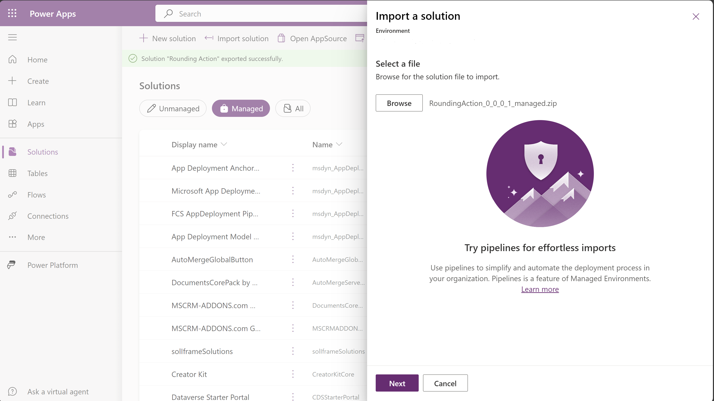
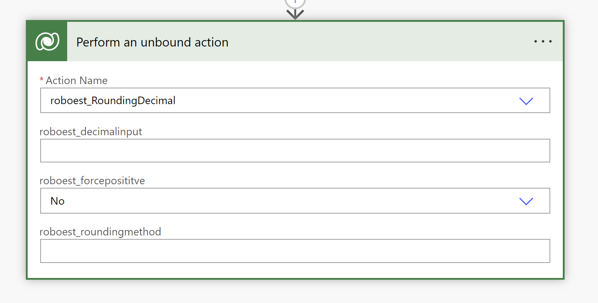

# Rounding

This project is a small plugin/Custom API project to fill a gap in the Power Automate functionality. 
The gap being the lack of conversion from Decimal values to an Integer. To make this as functional as possible to help secure against dirty input data the unbound action allows for 3 inputs: The decimal to convert, a boolean to force the value to be positive (all values under 0 become 0), and an optional rounding method string Round, RoundUp, RoundDown.


## Installation and utilization in low-code

To install this plug-in on your Power Platform environment unchanged:



```bash
  Download "RoundingAction_0_0_0_1_managed.zip"
  Upload in the Solutions view of the environment
```

As soon as it's uploaded on your environment you can use it through unbound actions in Power Automate, you can find the action with the name: "roboest_RoundingDecimal".




## Customization and deployment

To change the functionality of the plugin you can adjust the code found in this repository according to [Microsoft's documentation](https://learn.microsoft.com/en-us/power-apps/developer/data-platform/plug-ins)

```bash
  Pull the code to make your changes
  dotnet build (in the terminal)
  Download "RoundingAction_0_0_0_1_unmanaged.zip"
  Upload in the Solutions view of the environment
  pac tool prt (in the terminal)
  Update "(Assembly) Rounding"
  Select "Rounding.dll" in the ..\Rounding\bin\Debug\net462

```
## Who are we

At Roboest, we revolutionize business processes through low-code automation using the power of the Microsoft business applications ecosystem. We empower organizations to convert ad-hoc and manual workflows into digital solutions, connecting processes intelligently and creating applications that streamline operations and increase business agility.

[Our website](https://www.roboest.be/)